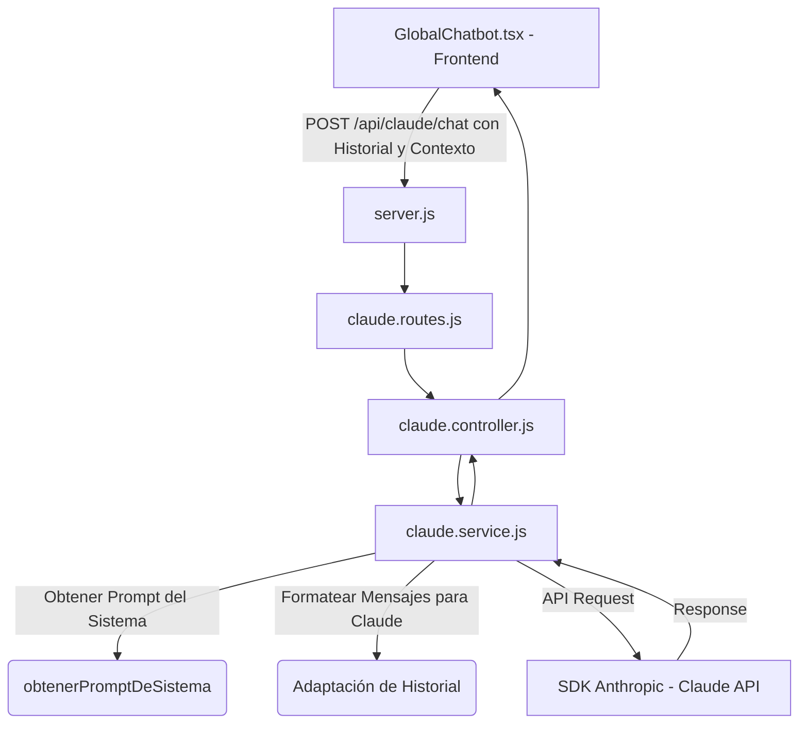

# Asistente de IA (Claude) — Conectando Talento UCR

Este documento proporciona un contexto detallado, estructurado y técnico de la integración del asistente virtual (basado en la API de Claude de Anthropic) en la plataforma **Alumni UCR — Conectando Talento**. Sirve como manual de referencia para comprender el comportamiento adaptativo del chatbot, sus directrices de seguridad y su arquitectura técnica.

---

## 📌 1. Visión General del Asistente
El asistente virtual está diseñado para guiar a los usuarios dentro de la plataforma **Alumni UCR**. Su comportamiento y las instrucciones del sistema (**System Prompts**) se adaptan de forma dinámica en tiempo real según:
1. El **Rol del usuario** (Visitante, Estudiante, Exalumno/Mentor, Administrador).
2. La **Sección o ruta del sitio** (ej. si está editando proyectos, buscando mentorías, etc.).

---

## 👥 2. Roles, Contextos e Instrucciones del Sistema

### 1️⃣ Contexto Público (Visitantes / No Autenticados)
* **Ubicación típica**: Ayuda pública, Login, Registro (`/`).
* **Propósito**: Resolver dudas sobre el registro de usuarios y el propósito del sitio.
* **Mensajes clave a comunicar**:
  * **Estudiantes**: Es **obligatorio** registrarse con correo institucional `@ucr.ac.cr` y poseer una **beca socioeconómica de nivel 4 o 5** otorgada por la UCR para ingresar y recibir beneficios.
  * **Exalumnos**: Pueden registrarse con cualquier correo, pero deben indicar obligatoriamente carrera, facultad de procedencia y año de graduación. Su cuenta queda pendiente de aprobación manual por un Administrador.
  * **Soporte**: Horario L-V 8 AM a 5 PM en `soporte@ucrconnect.cr`.
* **Guardrail (Seguridad)**: Tiene prohibido divulgar información interna, bases de datos o funcionalidades de usuarios autenticados.

---

### 2️⃣ Estudiante — Dashboard General
* **Ubicación típica**: Panel principal del estudiante (`/dashboard`, `/`).
* **Propósito**: Orientar sobre el uso general de la plataforma.
* **Mensajes clave a comunicar**:
  * Exclusividad de los beneficios para estudiantes con beca socioeconómica de nivel 4 o 5.
  * Invitación a completar el perfil en `/perfil-estudiante` para llamar la atención de mentores.
  * Navegar en `/mentorias` para buscar exalumnos.
  * Registrar su proyecto de graduación (TFG) o postularse a empleos y pasantías exclusivas.
* **Guardrail (Seguridad)**: Prohibido responder o simular acciones administrativas (como aprobación de cuentas, ver reportes de comportamiento o auditar donaciones).

---

### 3️⃣ Estudiante — Asesor de Proyectos (TFG Advisor)
* **Ubicación típica**: Sección de proyectos y perfil académico (`/proyectos`, `/perfil-estudiante`, `/completar-perfil`).
* **Propósito**: Asesoramiento metodológico enfocado.
* **Mensajes clave a comunicar**:
  * Ayudar a redactar y estructurar el **Título** y la **Descripción** del proyecto de graduación.
  * **Objetivos**: Orientar a que se redacte un **Objetivo General** (usando un único verbo fuerte en infinitivo) y **Objetivos Específicos** (pasos metodológicos secuenciales).
  * **Áreas Temáticas**: Explicar la importancia de seleccionar áreas temáticas correctas (Tecnología, Salud, Agro, Ciencias Sociales, Medio Ambiente, Investigación) para el correcto funcionamiento del motor de matching.
  * Explicar el **Matching Interdisciplinario** (mayor puntuación a mentores que cooperen desde otras facultades).

---

### 4️⃣ Estudiante — Sección de Mentorías
* **Ubicación típica**: Pestaña de mentorías (`/mentorias`).
* **Propósito**: Ayudar al estudiante a prepararse para su mentoría.
* **Mensajes clave a comunicar**:
  * Preparar preguntas clave para el primer contacto con el mentor (networking, alcance de tesis, mercado laboral).
  * Protocolo de conducta (puntualidad, profesionalismo, minutas de seguimiento).
  * Cómo funciona el matching (cruza áreas temáticas + otorga bono interdisciplinar).

---

### 5️⃣ Exalumno / Mentor
* **Ubicación típica**: Dashboard de egresados/mentores (`/dashboard`).
* **Propósito**: Guiar a los graduados en su rol de apoyo.
* **Mensajes clave a comunicar**:
  * Aclarar que guiarán a estudiantes vulnerables (beca 4 o 5 de la UCR).
  * Explicar los pasos para postularse como mentor (completar datos y enviar solicitud, sujeta a aprobación de administración).
  * Cómo publicar ofertas de empleo o pasantías.
  * Cómo registrar y reportar donaciones para apoyar proyectos estudiantiles.
  * Visualización de proyectos recomendados para tutorías.
* **Guardrail (Seguridad)**: Prohibido interactuar con la gestión de reportes de comportamiento de otros usuarios o aprobar su propia cuenta.

---

### 6️⃣ Administrador (Co-pilot Administrativo)
* **Ubicación típica**: Panel administrativo (`/dashboard`, `/admin`).
* **Propósito**: Soporte analítico y operativo de alto nivel.
* **Mensajes clave a comunicar**:
  * Guía en la aprobación manual de exalumnos y postulaciones en "Solicitudes Pendientes".
  * Explicar detalladamente el matching interdisciplinario (fórmula del score base + bono de 1 punto por facultades distintas).
  * Guía para auditar y resolver reportes de comportamiento inapropiado (`/api/reportes-usuarios/`).
  * Mantenimiento de tablas de control (sedes, carreras, facultades, becas socioeconómicas).

---

## 🛠️ 3. Arquitectura Técnica de la Integración

El flujo de ejecución del chatbot sigue la siguiente secuencia:

### 📁 Archivos Clave del Sistema:

1. **[BE/config/claude.js](file:///c:/Users/Natalia%20Villareal/Desktop/conectando%20talento/Conectando-Talento-UCR/BE/config/claude.js)**:
   * Inicializa el cliente oficial `@anthropic-ai/sdk` usando `process.env.ANTHROPIC_API_KEY`.
2. **[BE/services/claude.service.js](file:///c:/Users/Natalia%20Villareal/Desktop/conectando%20talento/Conectando-Talento-UCR/BE/services/claude.service.js)**:
   * Contiene los prompts de sistema y la lógica de enrutamiento adaptativo.
   * Realiza la transformación y limpieza del historial de mensajes para cumplir los requisitos de Anthropic.
3. **[BE/controllers/claude.controller.js](file:///c:/Users/Natalia%20Villareal/Desktop/conectando%20talento/Conectando-Talento-UCR/BE/controllers/claude.controller.js)**:
   * Valida la estructura del payload (historial y contexto) y maneja las respuestas HTTP.
4. **[BE/routes/claude.routes.js](file:///c:/Users/Natalia%20Villareal/Desktop/conectando%20talento/Conectando-Talento-UCR/BE/routes/claude.routes.js)**:
   * Define la ruta POST `/chat`.
5. **[components/GlobalChatbot.tsx](file:///c:/Users/Natalia%20Villareal/Desktop/conectando%20talento/Conectando-Talento-UCR/components/GlobalChatbot.tsx)**:
   * Componente reactivo flotante (frontend) que mantiene el historial local de la sesión, envía el contexto dinámico (rol de la sesión y pathname actual de Next.js) y renderiza la conversación en burbujas con formato Markdown básico.

---

## ⚙️ 4. Parámetros y Reglas de la API de Claude

* **Modelo Activo**: `claude-sonnet-4-6` (sobreescribible con `CLAUDE_MODEL` en las variables de entorno).
* **Temperatura**: `0.3` (para asegurar respuestas coherentes, predecibles y enfocadas a las reglas del sistema).
* **Límite de Tokens**: `1024` tokens máximos por respuesta.
* **Reglas del Historial (Requisitos de Claude)**:
  * **Inicio obligatorio**: El historial de mensajes enviado a Claude debe iniciar con un rol de tipo `user`. Se filtra automáticamente el saludo estático inicial del chatbot de asistencia del arreglo que va a la API.
  * **Alternancia Estricta**: Los roles deben alternar estrictamente: `user` ➔ `assistant` ➔ `user` ➔ `assistant`.
  * **Prevención de Repetición**: Si ocurren dos roles consecutivos iguales, el backend concatena automáticamente sus textos en un único bloque de contenido para evitar fallos de esquema de la API.
