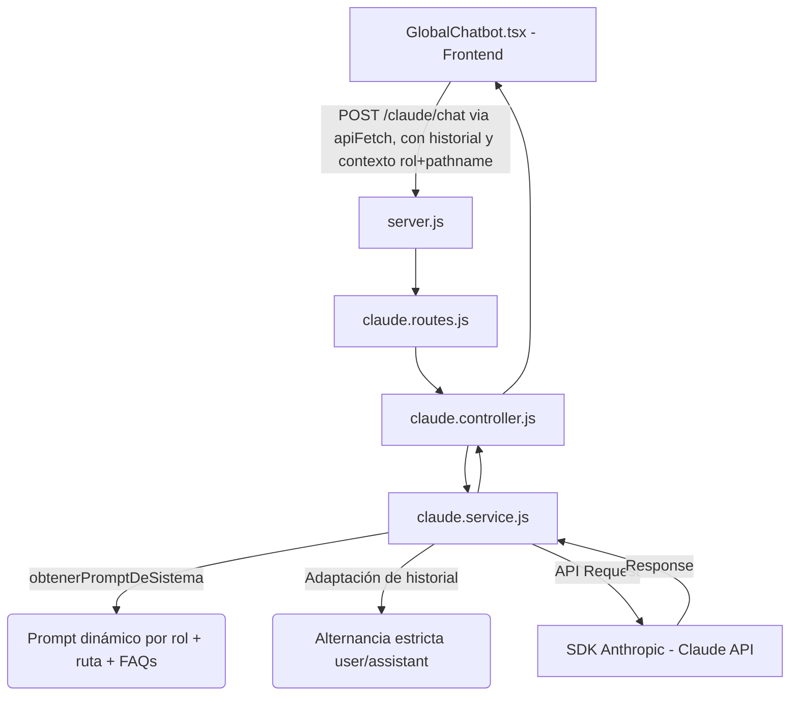

# Asistente de IA (Claude) — Conectando Talento UCR

> Verificado contra el código real del repo el 2026-07-07. Si algo de este documento
> contradice lo que ves en el código, **gana el código** — actualizá este archivo.

Este documento describe la integración de la API de Claude (Anthropic) en la plataforma
**Alumni UCR — Conectando Talento**. Hay **dos integraciones de IA distintas y separadas**,
no una sola — es el punto que más confusión genera, léelo con cuidado antes de tocar nada
relacionado con "el chatbot".

---

## 🌻 0. Las dos integraciones de IA (no confundir)

| | Mascota Alumni | Asistente Adaptativo (GlobalChatbot) |
|---|---|---|
| Componente FE | `components/landing/AlumniMascot.tsx` | `components/GlobalChatbot.tsx` (+ `ChatbotAvatar.tsx`) |
| Endpoint | `POST /api/alumni-chat` (route handler de **Next.js**, no del BE Express) | `POST /api/claude/chat` (BE Express real) |
| Dónde se renderiza hoy | `app/page.tsx` (landing) y `app/registro/page.tsx` | **Solo** `app/mi-curriculum/plantillas/page.tsx` |
| Prompts | Fijo, genérico para visitantes | Dinámico por rol + ruta (ver sección 2) |
| Propósito | Widget flotante de bienvenida/orientación pública | Asistente contextual "consciente del rol" (CV Advisor, Asesor de TFG, etc.) |

**⚠️ Discrepancia real detectada (2026-07-07):** el `GlobalChatbot.tsx` implementa toda la
lógica adaptativa por rol descrita en la sección 2 (admin, exalumno, estudiante en
mentorías/proyectos/CV), pero en el código actual **solo está montado en una página**
(`/mi-curriculum/plantillas`). No aparece en `StudentShell`, `ExalumnoDashboard`,
`AdminDashboard` ni `VoluntarioDashboard`. Si ves comportamiento adaptativo del chatbot
"desaparecer" fuera de esa página, no es un bug — es que ese componente todavía no está
integrado ahí. Confirmar con el equipo si la intención es expandirlo a más pantallas antes
de asumir que es un error.

---

## 👥 1. Roles y categorías de FAQ autorizadas (Asistente Adaptativo)

Constante real en `BE/services/claude.service.js` (`CATEGORIAS_PERMITIDAS`):

| Rol | Categorías de FAQ permitidas |
|---|---|
| `visitante` (default si no hay rol o no coincide) | Registro y Cuenta, Seguridad y Privacidad |
| `estudiante` | Registro y Cuenta, Estudiantes y Becas, Proyectos y Financiamiento, Seguridad y Privacidad, Exalumnos y Mentorías |
| `exalumno` | Registro y Cuenta, Exalumnos y Mentorías, Proyectos y Financiamiento, Donaciones, Seguridad y Privacidad |
| `admin` | Registro y Cuenta, Estudiantes y Becas, Exalumnos y Mentorías, Proyectos y Financiamiento, Donaciones, Seguridad y Privacidad |

> No existe categoría específica para `voluntario` en `CATEGORIAS_PERMITIDAS` — si ese rol
> llega al prompt, cae en el rama `else` (prompt `PUBLICO`), igual que un visitante. Revisar
> si esto es intencional antes de asumir que el voluntario debería tener su propio contexto.

Si el usuario pregunta algo fuera de sus categorías autorizadas, el sistema deniega con un
mensaje fijo (ver `seguridadFaqs` en `obtenerPromptDeSistema`), sin importar el rol.

### Prompts de sistema por rol + ruta (`obtenerPromptDeSistema`)

1. **Admin** (`rol === 'admin'`) → `PROMPTS.ADMIN` (fijo, sin variación por ruta).
2. **Exalumno** (`rol === 'exalumno'`) → `PROMPTS.EXALUMNO_GENERAL` (fijo, sin variación por ruta).
3. **Estudiante** (`rol === 'estudiante'`), variación por `pathname`:
   - `/mi-curriculum` → `PROMPTS.ESTUDIANTE_CV`, con el CV real del estudiante inyectado en
     el prompt (primero intenta con `contexto.perfil` en tiempo real del editor; si no,
     consulta `cv.service.js` por `usuario.id`).
   - `/proyectos`, `/perfil-estudiante`, `/completar-perfil` → `PROMPTS.ESTUDIANTE_PROYECTOS`
     (Asesor de TFG: título, descripción, objetivo general/específicos, áreas temáticas).
   - `/mentorias` → `PROMPTS.ESTUDIANTE_MENTORIAS`.
   - Cualquier otra ruta → `PROMPTS.ESTUDIANTE_GENERAL`.
4. **Cualquier otro rol / sin rol** → `PROMPTS.PUBLICO` (visitante).

Guardrails de seguridad (aplican mediante el bloque `seguridadFaqs`, no son prompts separados):
- El visitante nunca ve funcionalidades ni datos de usuarios autenticados.
- El estudiante nunca puede simular acciones administrativas.
- El exalumno nunca puede gestionar reportes de comportamiento ni aprobar su propia cuenta.
- El admin sí tiene acceso a las 6 categorías completas.

### Función extra: exalumno analizando a un estudiante

En `generarRespuestaSoporte`, si `rol === 'exalumno'` y hay usuario autenticado, el servicio
intenta detectar si el mensaje menciona el nombre de un estudiante (`buscarEstudiantePorNombre`)
para inyectar su perfil (onboarding + proyecto de graduación + CV) en el contexto y que Claude
pueda comentar sobre un match específico.

---

## 🛠️ 2. Arquitectura técnica (Asistente Adaptativo — GlobalChatbot)

### Archivos clave

1. **`BE/config/claude.js`** — inicializa el cliente `@anthropic-ai/sdk` con `process.env.ANTHROPIC_API_KEY`.
2. **`BE/services/claude.service.js`** — prompts de sistema, `CATEGORIAS_PERMITIDAS`, FAQs,
   lógica de enrutamiento por rol/ruta, formateo de CV, y adaptación del historial.
3. **`BE/controllers/claude.controller.js`** — expone `chatSoporte` (público, valida
   opcionalmente el Bearer token para enriquecer el contexto) y `careerAnalysis` (protegido,
   requiere `autenticarUsuario`).
4. **`BE/routes/claude.routes.js`**:
   - `POST /claude/chat` — pública (`chatSoporte`).
   - `POST /claude/career-analysis` — protegida (`autenticarUsuario` + `careerAnalysis`).
5. **`components/GlobalChatbot.tsx`** — widget flotante con `ChatbotAvatar.tsx`; usa
   `usePathname()` + `useAuth()` para armar el `contexto` (`{ rol, pathname }`) que envía en
   cada request junto con el historial local de la sesión.

### Mascota Alumni (integración separada)

- **`app/api/alumni-chat/route.ts`** — route handler de Next.js (no pasa por el BE Express).
- **`components/landing/AlumniMascot.tsx`** — widget flotante, imagen
  `public/images/3 sin fondo.png`, chat con streaming.
- Renderizada hoy en la landing (`app/page.tsx`) y en `app/registro/page.tsx`.
- Pendiente (según `CLAUDE.md` raíz): integrarla en más puntos de la landing.

---

## ⚙️ 3. Parámetros reales de la API de Claude

- **Modelo por defecto**: `claude-sonnet-5` (`process.env.CLAUDE_MODEL || 'claude-sonnet-5'`
  en `claude.service.js`, líneas ~482 y ~705). Overrideable con `CLAUDE_MODEL` en el `.env`.
  El chat de la mascota (`app/api/alumni-chat/route.ts`) usa por defecto
  `claude-haiku-4-5-20251001` (ver `CLAUDE.md` raíz) — **son modelos distintos a propósito**
  (el adaptativo necesita más razonamiento contextual; la mascota es liviana).
- **Temperatura**: `0.3` en ambas llamadas de `generarRespuestaSoporte`.
- **Límite de tokens**: `1024` por defecto, `1500` si el contexto es de CV (`esContextoCV`),
  `1200` en la segunda llamada (career-analysis). No es un valor único fijo como decía la
  versión anterior de este documento.
- **Reglas del historial** (obligatorias para la API de Anthropic):
  - Debe iniciar con un mensaje de rol `user` — el código busca el primer índice con
    `role === 'user'` y descarta lo anterior (incluyendo el saludo estático inicial).
  - Alternancia estricta `user` → `assistant` → `user` → `assistant`.
  - Si dos mensajes consecutivos tienen el mismo rol, se concatenan en un solo bloque de
    `content` para no romper el esquema de la API.
  - Si tras este proceso no queda ningún mensaje, se devuelve un saludo genérico fijo sin
    llamar a la API.

---

## Antes de asumir que hay un bug en el chatbot

1. Confirmá **cuál** de las dos integraciones estás mirando (sección 0) — comparten look and
   feel pero son código y endpoints completamente distintos.
2. Si es el Asistente Adaptativo y "no aparece" fuera de `/mi-curriculum/plantillas`, no es un
   bug — todavía no está montado en otras pantallas.
3. Si el rol es `voluntario`, hoy cae en el prompt público por diseño actual (no tiene
   categoría propia) — no es un error de permisos.
