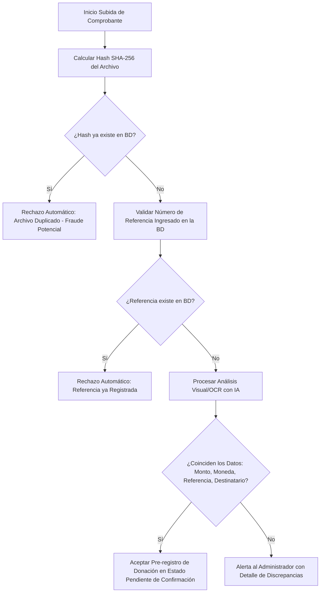

# Habilidad de Seguridad y Análisis de Comprobantes de Pago (SINPE Móvil y Bancos)

Esta habilidad establece las directrices de seguridad, los controles de integridad y las reglas de extracción automatizada para comprobar la veracidad de los comprobantes de donación (SINPE Móvil y Transferencias Bancarias) subidos por los exalumnos en la plataforma "Alumni UCR — Conectando Talento".

## Objetivo de la Habilidad

Evitar fraudes financieros o registros erróneos en el sistema de donaciones mediante la verificación estricta de comprobantes físicos/digitales. Esto se logra mediante tres capas de seguridad:
1. **Seguridad Criptográfica (Prevención de duplicación física):** Comprobar que el archivo de imagen o PDF cargado no coincida exactamente con ningún archivo previamente subido a la plataforma.
2. **Seguridad Transaccional (Número de referencia):** Validar que el número de transacción único otorgado por la entidad bancaria o el operador telefónico de SINPE Móvil no esté duplicado en la base de datos de transacciones del sistema.
3. **Validación de Datos (Integridad y Veracidad):** Analizar visualmente la captura de pantalla o PDF mediante IA/OCR para extraer el monto, moneda, destinatario, emisor y fecha, y contrastarlos contra lo declarado por el usuario.

---

## Formatos Comunes de Pago en Costa Rica

El validador de comprobantes debe estar familiarizado con las características visuales y textuales de los siguientes canales:

### A. Mensajes SMS de SINPE Móvil
Suelen provenir de números cortos como `2627` (BCR), `1909` (BNCR) o `2222` (BAC). Tienen estructuras de texto rígidas:
* **Ejemplo BCR:** *"SINPE Movil: Ha enviado [Monto] a [Telefono] de [NombreDestino] Ref: [NumRef] el [Fecha] [Hora] - Dudas: 2211-1111"*
* **Ejemplo Banco Nacional:** *"BN Sinpe Movil: Transf. realizada por [Monto] a favor de [NombreDestino] tel [Telefono]. Comprobante: [NumRef]. Info: 2212-2000"*

### B. Capturas de Pantalla de Aplicaciones Móviles
Suelen contener:
* El logo de la entidad (BAC Credomatic, Banco Nacional, Banco de Costa Rica, Davivienda, Promerica, Lafise, etc.).
* Títulos como "Transferencia Exitosa", "Comprobante de SINPE", "Detalle de Transferencia".
* El número de teléfono destino (debe ser el de la UCR o el fondo de la plataforma).
* El número de referencia de la transferencia (usualmente de 6 a 16 dígitos numéricos o alfanuméricos).

### C. Comprobantes en PDF
* Generados por la banca en línea de las instituciones financieras.
* Estructura formal, con firma digital o sellos de procesamiento digital.

---

## Lógica Algorítmica y Capas de Verificación (Backend)

Al procesar una donación con su comprobante de pago, el backend debe ejecutar los siguientes controles lógicos:



### Reglas Técnicas Obligatorias:
1. **Hashing del Comprobante:** Antes de almacenar la imagen o PDF en el Storage de Supabase (`comprobantes`), el sistema debe calcular el hash `SHA-256` del buffer del archivo. Si este hash existe en la columna `archivo_hash` de la tabla `donaciones`, se cancela la operación informando que el archivo ya ha sido utilizado para otra transacción.
2. **Validación de Referencia de Transacción:** Comparar el número de referencia ingresado por el usuario (`numero_referencia`) con el registro histórico de donaciones. De coincidir con una donación previa, se descarta para evitar la doble declaración del mismo movimiento de dinero.
3. **Validación de la Entidad Destinataria:** El comprobante debe registrar que el dinero ingresó a las cuentas institucionales o al número telefónico autorizado para SINPE Móvil. Si el receptor del dinero es una cuenta privada ajena, el sistema debe alertar al administrador.

---

## Plantilla de Prompt para Extracción Visual por IA (Multimodal)

Para validar el contenido del comprobante visualmente (ej. una imagen JPEG o PNG del SINPE Móvil), envía la imagen al modelo de visión con las siguientes directrices y exige un formato de respuesta estructurado en JSON:

```text
Analiza la captura de pantalla o documento adjunto que corresponde a un comprobante de transferencia bancaria o transacción de SINPE Móvil en Costa Rica.
Extrae los siguientes datos con máxima precisión y devuelve ÚNICAMENTE un objeto JSON con el formato estructurado que se indica a continuación:

{
  "comprobante_valido": true/false, // false si la imagen no es un comprobante de transferencia o SINPE válido
  "numero_referencia": "XXXXXX", // Número de referencia o comprobante exacto extraído de la imagen (solo dígitos o caracteres alfanuméricos)
  "monto": 50000.00, // Número decimal correspondiente al monto transferido
  "moneda": "CRC", // Moneda: CRC (Colones) o USD (Dólares)
  "fecha_hora": "YYYY-MM-DD HH:mm:ss", // Fecha y hora aproximada de la transacción. Si no tiene hora, poner solo YYYY-MM-DD
  "nombre_receptor": "Nombre del Beneficiario", // Nombre de la persona o entidad que recibió el dinero
  "telefono_receptor": "8888-8888", // Si es SINPE móvil, teléfono que recibió el dinero. Si no está visible, nulo.
  "nombre_emisor": "Nombre del Remitente", // Nombre de quien realiza el pago
  "banco_origen": "Banco Nacional / BCR / BAC / etc.", // Nombre del banco de origen
  "confianza_extraccion": 0.95, // Nivel de seguridad del OCR de 0 a 1. Si los textos son borrosos, reducir este valor.
  "detalles_sospechosos": "Notas si se sospecha de alteración visual, edición del monto o incoherencias"
}

Asegúrate de:
1. Limpiar los espacios o guiones en el número de referencia.
2. No inventar datos. Si un campo no está visible o legible, establécelo como nulo (null).
3. Evaluar críticamente si el comprobante parece editado o manipulado digitalmente (por ejemplo, fuentes de letras inconsistentes en el monto, alineaciones extrañas) y repórtalo en 'detalles_sospechosos'.
```

---

## Directrices para el Código del Backend

1. **Tabla de la Base de Datos:** Se sugiere ampliar la tabla `donaciones` con las siguientes columnas si no existen:
   - `archivo_hash` (VARCHAR(64), UNIQUE) — Hash SHA-256 del comprobante subido.
   - `extraccion_ia` (JSONB) — Datos extraídos automáticamente por la IA para auditorías posteriores.
   - `banco_origen` (VARCHAR(100)) — Nombre del banco emisor.
2. **Manejo de Errores y Alertas:** Si la confianza de extracción de la IA es menor a `0.80` o si hay discrepancias sustanciales entre los datos extraídos y los declarados (ej. el usuario declara ₡50.000 pero el comprobante dice ₡5.000), la donación debe ser guardada en un estado especial `sospechosa` o registrar una alerta visible en el panel del Administrador para su revisión exhaustiva antes de proceder a la aprobación manual de la donación.
3. **Auditoría de Duplicados en Base de Datos:** Antes de realizar el guardado, haz una consulta simple:
   ```javascript
   const { data } = await supabase
       .from('donaciones')
       .select('id')
       .or(`numero_referencia.eq.${numeroReferencia},archivo_hash.eq.${fileHash}`)
       .maybeSingle();
   ```
   Si esta consulta retorna algún registro, frena la creación inmediatamente.
